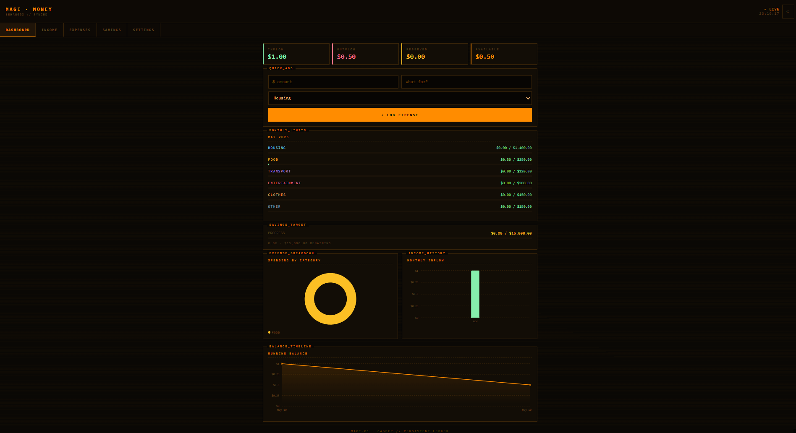

# MAGI · MONEY

> Personal budget tracker with cross-device sync, built on a dark terminal aesthetic inspired by Neon Genesis Evangelion's MAGI supercomputer system.


**[→ Live Demo](https://magimoney.netlify.app)**



---

## Features

- **Real-time sync** — transactions update instantly across all devices via Supabase Realtime
- **Dashboard** — running balance, spending donut chart, monthly income bar chart, balance timeline
- **Quick Add** — log an expense in 3 taps without leaving the dashboard
- **Budget limits** — set monthly caps per category; bars turn yellow at 80%, red when exceeded
- **Custom categories** — add, rename, recolor, or delete spending categories
- **Search & filter** — filter any ledger by label, category, or date
- **Soft delete + undo** — 5-second undo window on every delete
- **CSV export** — download all transactions for Excel or Google Sheets
- **PWA** — installable to iPhone/Android home screen, offline shell caching
- **Magic link auth** — passwordless sign-in via email, session persists across visits

## Stack

| Layer | Tech |
|---|---|
| Frontend | React 18 + Vite |
| Database | Supabase (Postgres) |
| Auth | Supabase Magic Link |
| Realtime | Supabase Realtime |
| Charts | Recharts |
| Deployment | Netlify |
| PWA | Service Worker (custom) |

## Architecture

```
src/
├── components/
│   ├── MagiBudget.jsx   # Main UI — dashboard, ledgers, settings
│   └── Auth.jsx         # Magic link sign-in screen
├── hooks/
│   ├── useSupabaseData.js   # useTable, useGoal, useCategories, useBudgetLimits
│   └── usePullToRefresh.js  # Native iOS pull-to-refresh gesture
├── lib/
│   ├── supabase.js      # Supabase client
│   ├── theme.js         # Design tokens, default categories, formatters
│   └── csv.js           # CSV export utility
supabase/
├── schema.sql           # Initial tables + RLS policies
└── migration_v2.sql     # Categories, budget limits, soft delete, realtime
```

## Database Schema

```sql
income        — id, user_id, label, amount, type, date, deleted_at
expenses      — id, user_id, label, amount, category, date, deleted_at
savings       — id, user_id, amount, note, date, deleted_at
goals         — user_id (PK), savings_goal
categories    — id, user_id, name, color, sort_order
budget_limits — user_id + category (PK), monthly_limit
```

Row-Level Security is enabled on all tables — users can only read and write their own data.

## Local Development

```bash
git clone https://github.com/BrysonLH/magi-budget.git
cd magi-budget
npm install
cp .env.example .env
# Add your Supabase URL and anon key to .env
npm run dev
```

Requires a Supabase project with `schema.sql` and `migration_v2.sql` applied.

## Deployment

Deployed via Netlify with GitHub continuous deployment. Every push to `main` triggers a new build. Environment variables (`VITE_SUPABASE_URL`, `VITE_SUPABASE_ANON_KEY`) are set in the Netlify dashboard — never committed to the repo.

---

*MAGI-01 · CASPER // Built by Bryson Hawthorne*
